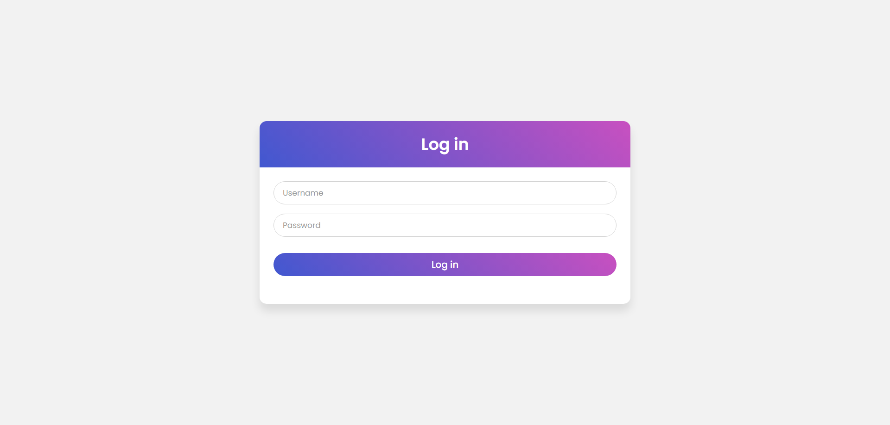
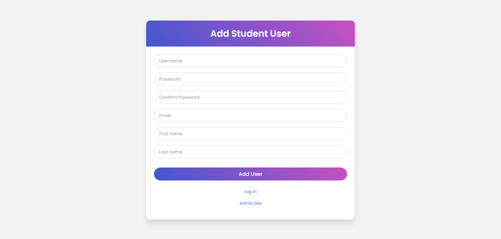
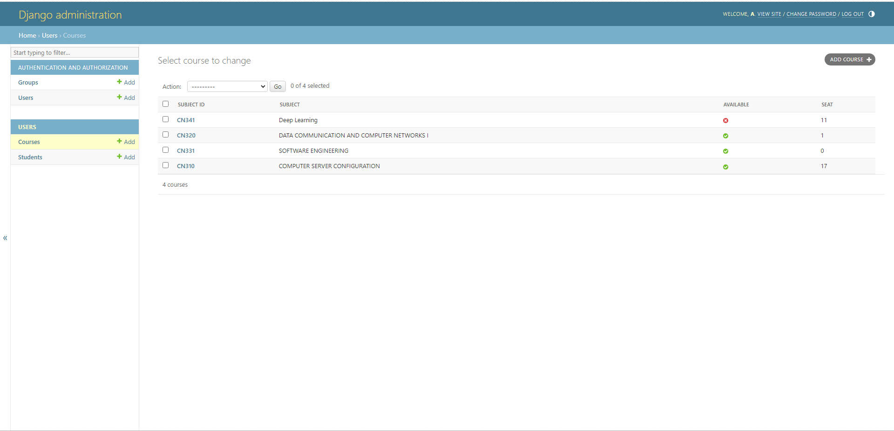
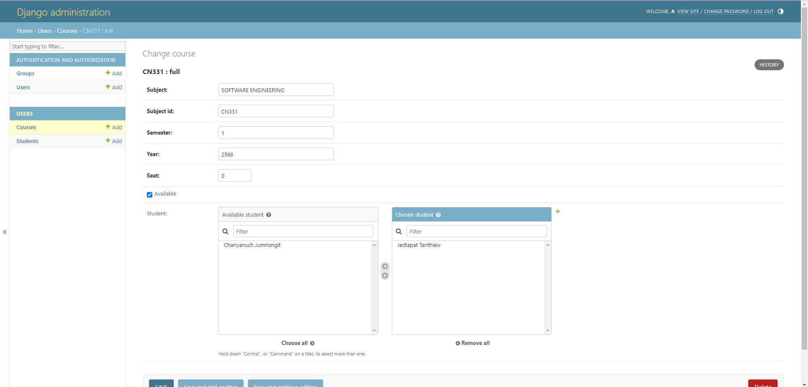
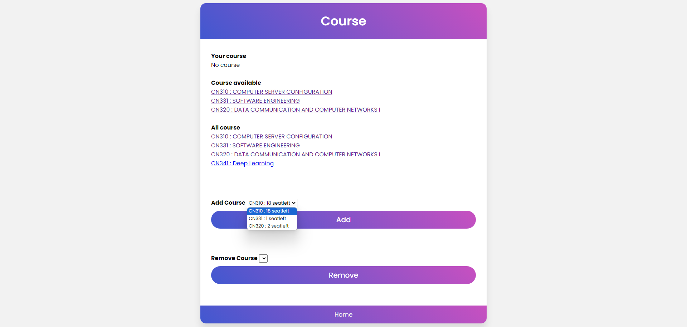
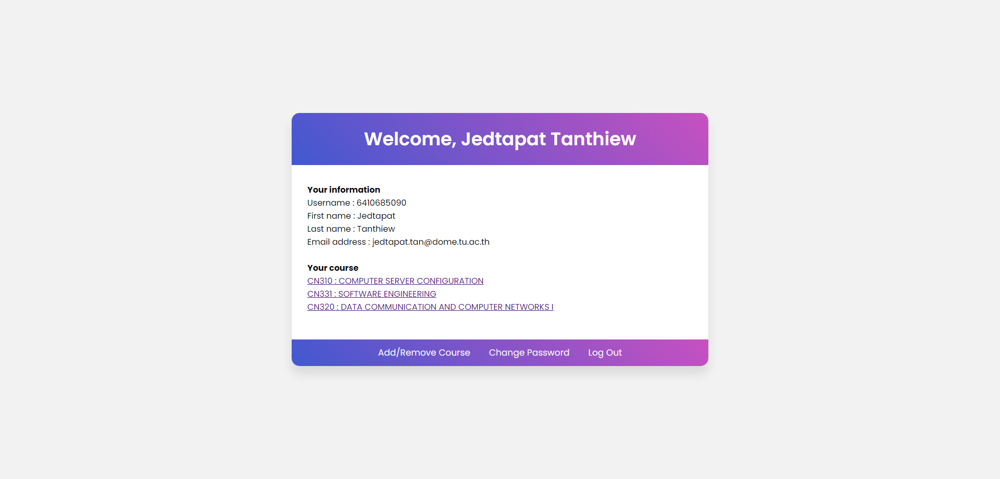
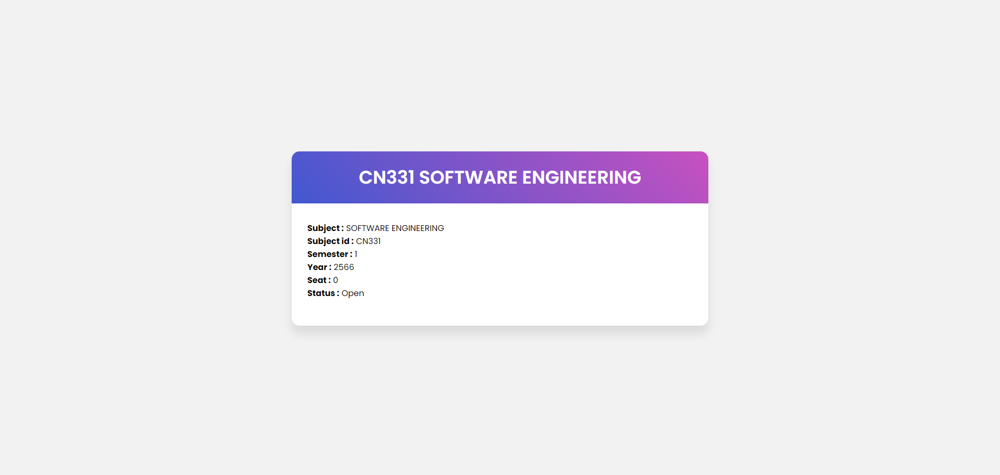
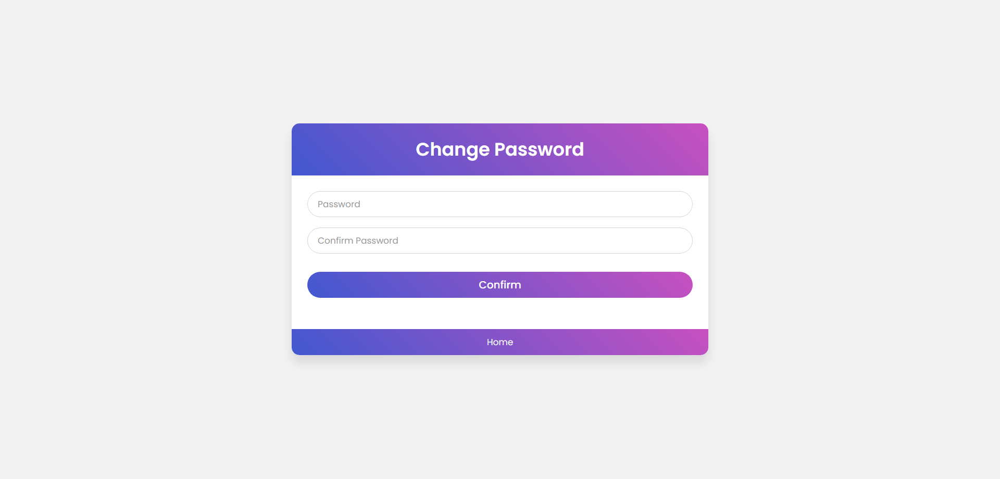

# Assignment 2

## สมาชิก

1. นายเจตพัฒน์ ตันเทียว 6410685090
1. ชัญญานุช จำนงนิตย์ 6410615022 

## Clip การใช้งาน

https://drive.google.com/file/d/1JEfCesZYBXNEqys1ykYRHaLkjP8hJhDG/view?usp=sharing

## วิธีการใช้งาน

หน้านี้คือหน้าไว้สำหรับล็อกอิน

### เมื่อล็อกอินเข้ามาโดยใช้ admin user 

เมื่อล็อกอินเข้ามาโดยใช้ admin user จะเข้ามาหน้าสำหรับการ adduser ใหม่ และในทางด้านล่างจะเห็น Admin Site กดเพื่อสำหรับเข้าไปที่ Admin interface

ในAdmin Interface สวนนี้เป็นรายระเอียดของ Course ต่างๆ ที่มีอยู่

โดยในหน้า Course จะสามารถปรับค่าต่างๆ ได้ และสามารถดูนักศึกษาที่ได้กดขอโควต้าไปได้

### เมื่อล็อกอินเข้ามาโดยใช้ student user 

จะเป็นหน้าที่แสดงข้อมูลต่างๆ ของ User

โดยเมื่อกด Add/Remove Course จะเข้ามาหน้าสำหรับกดขอโควต้า โดยแสดงวิชาที่ได้ขอไปแล้ว วิชาที่เปิดให้ขอ และวิชาทั้งหมดที่มี และในด้านล่างให้เลือกวิชาในช่องที่จะขอโควต้า แล้วกด add และการยกเลิกการขอโควต้า โดยเลือกวิชาในช่องแล้วกด remove

ตัวอย่างเมือ add แล้ว

เราสามารถกดดูข้อมูลรายวิชาได้โดยกดที่ชื่อวิชานั้นๆ

หน้า changepass ใช้สำหรับเปลียนรหัสเมื่อได้รหัสจาก admin แล้ว

